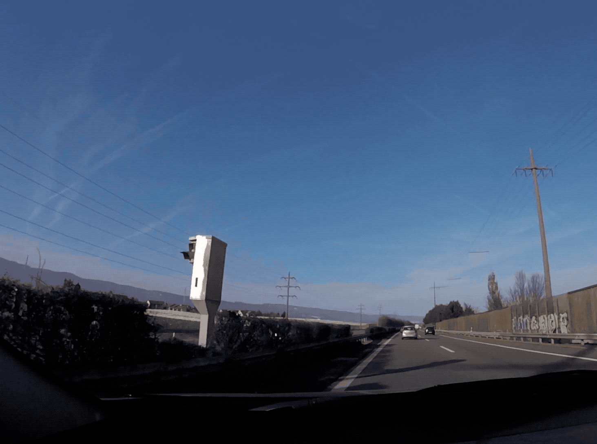
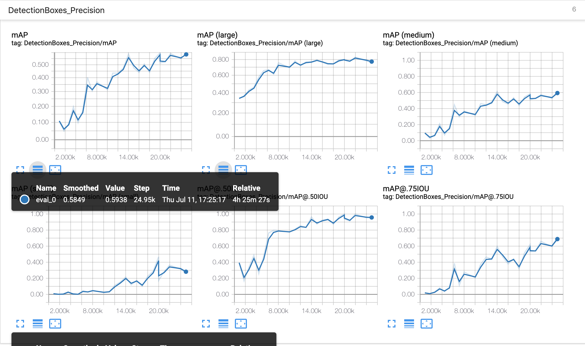
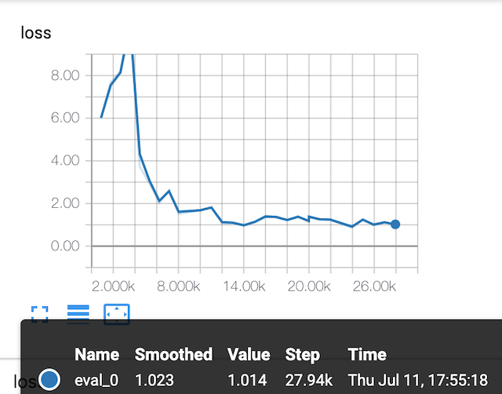
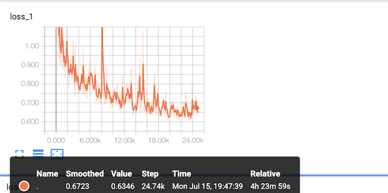
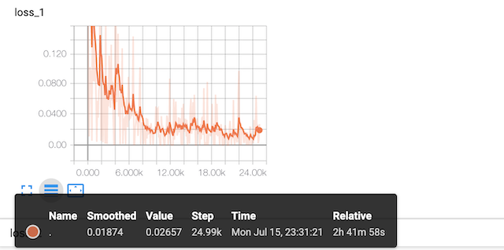
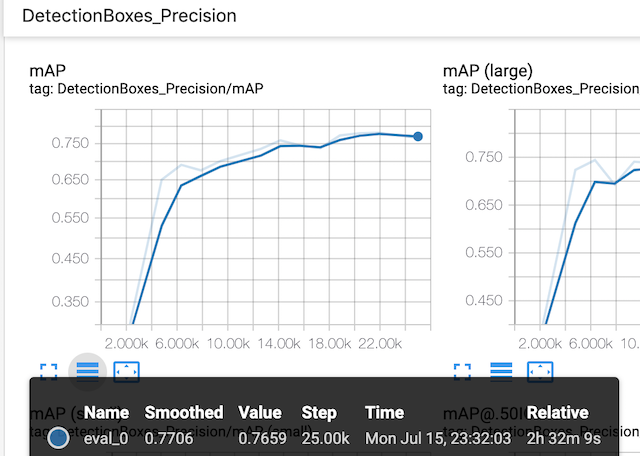

# Custom-class object detection

Training of a neural net for custom class object detection with Tensorflow Object Detection API.

## Contents
<!-- TOC depthFrom:1 depthTo:4 withLinks:1 updateOnSave:1 orderedList:0 -->

- [Custom-class object detection](#custom-class-object-detection)
	- [Contents](#contents)
	- [Summary](#summary)
	- [Part 1 : Building the data set](#part-1-building-the-data-set)
		- [Collecting data for Training](#collecting-data-for-training)
			- [First try : Collecting images from Google Image Search](#first-try-collecting-images-from-google-image-search)
			- [Second try : Collecting images from GoPro footage](#second-try-collecting-images-from-gopro-footage)
		- [Extracting frames from video footage :](#extracting-frames-from-video-footage-)
		- [Labelling and annotating train data](#labelling-and-annotating-train-data)
		- [Converting to TFRecord file format](#converting-to-tfrecord-file-format)
		- [Final dataset](#final-dataset)
	- [Part 2 : Training the net](#part-2-training-the-net)
		- [Tensorflow Object Detection API](#tensorflow-object-detection-api)
		- [Choosing the architecture of the net](#choosing-the-architecture-of-the-net)
		- [Hardware for training](#hardware-for-training)
		- [Configuring the training pipeline](#configuring-the-training-pipeline)
			- [Download pre-trained weights](#download-pre-trained-weights)
			- [Modify config files](#modify-config-files)
			- [Training workflow](#training-workflow)
	- [Part 3 : Results](#part-3-results)
		- [1 - Single Shot Detector (SSD) models](#1-single-shot-detector-ssd-models)
			- [ssd_mobilenet_v2_coco results](#ssdmobilenetv2coco-results)
			- [ssd_resnet50_v1_fpn_shared_box_predictor_640x640_coco14_sync results](#ssdresnet50v1fpnsharedboxpredictor640x640coco14sync-results)
			- [Adding background images to reduce false positive detection:](#adding-background-images-to-reduce-false-positive-detection)
			- [Takeaways:](#takeaways)
		- [2 - Faster RCNN](#2-faster-rcnn)
			- [faster_rcnn_inception_v2_coco](#fasterrcnninceptionv2coco)
			- [faster_rcnn_resnet101_kitti :](#fasterrcnnresnet101kitti-)
			- [Takeaways:](#takeaways)
	- [Conclusion](#conclusion)

<!-- /TOC -->

## Summary

This is a proposition for the Capstone project for the EPFL Extension School Applied Machine Learning program. The objective is to train a neural net for custom class object detection and run inference at the edge by:
- building a custom data set and annotate it;
- train a network using data augmentation techniques and transfer learning with fine-tuning of the last layers;
- (if possible) running inference at the edge on a device with limited computing power.

I will thoroughly document each phase of the project and draw conclusions on the best techniques to use.

## Part 1 : Building the data set

### Collecting data for Training

#### First try : Collecting images from Google Image Search

I used this [`repo on github`](https://github.com/hardikvasa/google-images-download) to collect images from the web.

I chose a custom class of objects (speed-traps), and searched for specific keywords and also reverse searched for specific images, using the code below :

```python
from google_images_download import google_images_download

response = google_images_download.googleimagesdownload()   #class instantiation

arguments = {
"keywords":"Traffic-Observer, radar autoroute suisse, schweizer autobahnblitzern, schweizer autobahnradar, speedtrap swiss",
"similar_images":"https://www.scdb.info/blog/uploads/technology/11_gross.jpg",
"output_directory":"new_model_data",
"print_urls":True
}
paths = response.download(arguments)   #passing the arguments to the function
print(paths)   #printing absolute paths of the downloaded images
```

Then renamed them and placed them in an appropriate folder structure:

```python
import os
imdir = 'images'
if not os.path.isdir(imdir):
    os.mkdir(imdir)

    radar_folders = [folder for folder in os.listdir('new_model_data') if 'radar' in folder]
    print(radar_folders)

    n = 0
    for folder in radar_folders:
    for imfile in os.scandir(os.path.join('/Documents/',folder)):
        os.rename(imfile.path, os.path.join(imdir, '{:06}.png'.format(n)))
        n += 1
```

It resulted in a very limited dataset (about 100 images), not coherent enough : different types of speed traps, different point of views... As a consequence, this dataset was discarded.

#### Second try : Collecting images from GoPro footage

I attached a GoPro camera to the dashboard of my car and filmed my trips on Swiss highways. The footage captures many speedtraps. This will be used as a train / test set.

Methodology for filming :
- filming at 60 fps, with GoPro Hero+
- 1920 x 1080 resolution
- camera mounted on the dashboard of the car
- filming the same object with different lighting conditions, slightly different angles

Post-processing in iMovie:
- shortening the video clip to approx. 30 seconds,
- only when speed traps are visible (long, medium & close range)
- simple color grading

Example of footage :


### Extracting frames from video footage :

Running this [`code`](https://github.com/petrum01/Capstone_project_object_detection/blob/master/creating_dataset/extract_frames.py) extracts frames from the input video footage. See output frames [`here`](https://github.com/petrum01/Capstone_project_object_detection/tree/master/creating_dataset/frames).

### Labelling and annotating train data



I used [`RectLabel`](https://github.com/ryouchinsa/Rectlabel-support) to:
- create bounding boxes for each image
- generate annotation output in xml format for each image
- splitting dataset into train & test sets : 80 / 20, effectively creating two .txt files with the list of images
- create [`label map`](https://github.com/petrum01/Capstone_project_object_detection/blob/master/creating_dataset/data/label_map.pbtxt) in proto format for Tensorflow

Checking if there are images without annotations:

```python
import os
annot_dir = 'creating_dataset/frames/annotations'
img_dir = 'creating_dataset/frames'
filesA = [os.path.splitext(filename)[0] for filename in os.listdir(annot_dir)]
filesB = [os.path.splitext(filename)[0] for filename in os.listdir(img_dir)]
print ("images without annotations:",set(filesB)-set(filesA))
```

### Converting to TFRecord file format

TFRecord is Tensorflow’s own binary storage format. We need to convert the dataset (images in .jpg format and annotations in .xml format) to this format in order to improve the performance of our import pipeline and as a consequence, lowering the training time of our model.

Indeed, instead of loading the data simply using python code at each step and feed it into a graph, we will use an input pipeline which takes a list of files (in this case in TFRecord format), create a file queue, read, and decode the data.

For each set (train & test), we run this [`script`](https://github.com/petrum01/models/blob/master/research/object_detection/dataset_tools/rectlabel_create_pascal_tf_record.py) by calling in the terminal :
<!--
- rectlabel_create_pascal_tf_record.py file to be copied in /Users/pm/Documents/AI/compvision/Object_detection/tfod/models/research/object_detection/dataset_tools
- copy annotations in images folder (images/annotation/)
-->

```bash
python object_detection/dataset_tools/rectlabel_create_pascal_tf_record.py \
    --images_dir="creating_dataset/frames" \
    --image_list_path="creating_dataset/train.txt" \
    --label_map_path="creating_dataset/data/label_map.pbtxt" \
    --output_path="creating_dataset/data/"
```
[`source`](https://rectlabel.com/help#tf_record)

We then can inspect tfrecord files to ensure the integrity of theses files and test if the conversion process went correctly by counting the number of records in the TFRecord train & test files.

```python
import tensorflow as tf

for example in tf.python_io.tf_record_iterator("creating_dataset/data/test.record"): # inspecting one record
    result = tf.train.Example.FromString(example)
print(result)

a = sum(1 for _ in tf.python_io.tf_record_iterator("creating_dataset/data/train.record")) # Counting the number of records
print('Number of records in train:', a)

b = sum(1 for _ in tf.python_io.tf_record_iterator("creating_dataset/data/test.record"))
print('Number of records in test:', b)
```

Resulting test and train sets can be found [`here`](https://github.com/petrum01/Capstone_project_object_detection/tree/master/creating_dataset/data).

### Final dataset

The final dataset consists of :
- 400 labeled images with a 80/20 split bewteen train & test sets
- one class of object (speedtrap)
- images with object at medium & close range
- images with object at long range (small object)
- in at least two different lighting conditions

<!-- Frames 0 to 248 from GoPro footage (rushs n° GOPRO484 at 9:24 & 11:25, n°GPO10484 at 2:16, 7:23, 7:54).
Frames 249 to 399 from GoPro footage on bad lighting conditions and also with small objects
(old name : TFOD_latest_short.mp4, changed to gopro_footage_edited.mp4) -->


## Part 2 : Training the net

### Tensorflow Object Detection API

I found many advantages in using Tensorflow Object Detection API, the most important one being the possibility to train multiple models quickly, and to find which one suits best to my needs in a limited timeframe.

I forked the Tensorflow repo on github and added some code to perform training, evaluation, and inference. I will link to the code I wrote in this readme.

### Choosing the architecture of the net

In the field of computer vision, many pre-trained models are now publicly available, and can be used to bootstrap powerful vision models out of very little data.

There are a large number of model parameters to configure. The best settings will depend on your given application. Faster R-CNN models are better suited to cases where high accuracy is desired and latency is of lower priority. Conversely, if processing time is the most important factor, SSD models are recommended.

The aim is to find a model with a correct balance between detection accuracy and speed in order to make inference at the edge possible.

I choose to train several models already implemented in Tensorflow Object Detection API that can be found [`here`](https://github.com/petrum01/models/blob/master/research/object_detection/g3doc/detection_model_zoo.md).

### Hardware for training

I used [`Paperspace`](https://www.paperspace.com/) which is a cloud platform that provides Linux virtual machines with GPU computing power.

The setup is comprised of :
- multiple virtual machines
- each with a Quadro P4000 GPU
- running Ubuntu 18.04
- CUDA drivers 9.0.176
- tensorflow-gpu (1.12.0)
- a more detailed list of packages can be found [`here`](https://github.com/petrum01/Capstone_project_object_detection/tree/master/resources/requirements.txt)

Setting up the virtual machine took quite a long time, as conflicts were frequent between libraries, especially with opencv. Also, finding the right combination of CUDA drivers & Tensorflow version was crucial.

I accessed the virtual machines from my local machine through ssh.

### Configuring the training pipeline

#### Download pre-trained weights

We want to train the last layers of a model (or fine-tune the model) on our custom dataset. Training from scratch can take a long time, sometimes up to weeks depending on the computing power.

Pre-trained weights for different models are available [`here`](https://github.com/tensorflow/models/blob/master/research/object_detection/g3doc/detection_model_zoo.md), models have been trained on different public datasets (COCO, Kitti, etc.)

#### Modify config files

> The Tensorflow Object Detection API uses protobuf files to configure the
training and evaluation process. The schema for the training pipeline can be
found in object_detection/protos/pipeline.proto. At a high level, the config
file is split into 5 parts:
>1. The `model` configuration. This defines what type of model will be trained
(ie. meta-architecture, feature extractor).
>2. The `train_config`, which decides what parameters should be used to train
model parameters (ie. SGD parameters, input preprocessing and feature extractor
initialization values).
>3. The `eval_config`, which determines what set of metrics will be reported for
evaluation.
>4. The `train_input_config`, which defines what dataset the model should be
trained on.
>5. The `eval_input_config`, which defines what dataset the model will be
evaluated on. Typically this should be different than the training input
dataset.
> -- [`source`](https://github.com/tensorflow/models/blob/master/research/object_detection/g3doc/configuring_jobs.md)

Config files are relative to a specific pre-trained model and can be found [`here`](https://github.com/tensorflow/models/tree/master/research/object_detection/samples/configs). We need to apply some changes to the config file in order to initiate training.

Below are the standard changes that we shall need to apply to the downloaded .config file:

```
model {
  ssd {
    num_classes: 1  #number of classes to be trained on
[...]

train_config: {
  batch_size: 24 #increase or decrease depending of GPU memory usage
[...]

  fine_tune_checkpoint: "/pre-trained-model/model.ckpt"    #Path to extracted files of pre-trained model

  from_detection_checkpoint: true
[...]

train_input_reader: {
  tf_record_input_reader {
    input_path: "/data/train.record"   #Path to training TFRecord file
  }
  label_map_path: "/data/label_map.pbtxt"  #Path to label map file
}
[...]

eval_input_reader: {
  tf_record_input_reader {
    input_path: "/data/test.record"  # Path to testing TFRecord
  }
  label_map_path: "/data/label_map.pbtxt"   # Path to label map file
}
```

Also, depending on the model, we will need to change the batch size, the data augmentation options, etc. Data augmentation options are the following (list not exhaustive, complete defintion of these augemntation techniques can be found [`here`](https://github.com/tensorflow/models/blob/master/research/object_detection/core/preprocessor.py)):
```
data_augmentation_options {
  random_horizontal_flip {
  ssd_random_crop {
  random_adjust_brightness {
  random_adjust_contrast {
  random_adjust_hue {
  random_adjust_saturation {
  random_distort_color {
```

#### Training workflow

 - Starting training

From the training directory, run:
```sh
PIPELINE_CONFIG_PATH=pipeline.config #path to the modified config file
MODEL_DIR=training/ #path to the directory where training checkpoints will be saved
NUM_TRAIN_STEPS=25000 #number of training steps
SAMPLE_1_OF_N_EVAL_EXAMPLES=1
python model_main.py \
   --pipeline_config_path=${PIPELINE_CONFIG_PATH} \
   --model_dir=${MODEL_DIR} \
   --num_train_steps=${NUM_TRAIN_STEPS} \
   --sample_1_of_n_eval_examples=$SAMPLE_1_OF_N_EVAL_EXAMPLES \
   --alsologtostderr
```

- Monitoring the training process with Tensorboard

From the training directory, run:
```bash
$tensorboard --logdir training
```
However I had to set up a proxy to re-route tensorboard from the virtual machine to my local machine.

<!--
Set proxy to monitor from local machine
./ngrok http 6006
(source : https://ngrok.com/docs)
-->
- Monitoring GPU usage is useful in the first stages of training to see if everything worked properly

```bash
$nvidia-smi -l
```

- Exporting a trained model for inference

I exported frozen graphs at different stages of training in order to test the inference, by running the [`export_inference_graph.py`](https://github.com/tensorflow/models/blob/master/research/object_detection/g3doc/exporting_models.md) script:

```bash
INPUT_TYPE=image_tensor
PIPELINE_CONFIG_PATH=pipeline.config #path to the modified config file
TRAINED_CKPT_PREFIX=training/model.ckpt-xxxx #path to the desired checkpoint
EXPORT_DIR=/output-inference-graph
python export_inference_graph.py \
    --input_type=${INPUT_TYPE} \
    --pipeline_config_path=${PIPELINE_CONFIG_PATH} \
    --trained_checkpoint_prefix=${TRAINED_CKPT_PREFIX} \
    --output_directory=${EXPORT_DIR}
```

- Testing inference

Then, use the exported frozen graph to perform detection on an evaluation video.

From models/research/object_detection run [`object_detection_from_video.py`](https://github.com/petrum01/Capstone_project_object_detection/tree/master/object_detection_from_video.py).

## Part 3 : Results

### 1 - Single Shot Detector (SSD) models

SSD is a popular algorithm in object detection. It’s generally faster than Faster RCNN. Single Shot means that the tasks of object localization and classification are done in a single forward pass of the network (increases speed).

So my main goal by choosing this model is to have a decent inference speed, so I could perform inference with the trained model on a device with limited computing capability.

<!-- These models were trained using the combined dataset -->
Models trained :

| Model name  | Speed (ms) | COCO mAP |
| ------------ | :--------------: | :--------------: |
| [ssd_mobilenet_v2_coco](http://download.tensorflow.org/models/object_detection/ssd_mobilenet_v2_coco_2018_03_29.tar.gz) | 31 | 32 |
| [ssd_resnet_50_fpn_coco](http://download.tensorflow.org/models/object_detection/ssd_resnet50_v1_fpn_shared_box_predictor_640x640_coco14_sync_2018_07_03.tar.gz) | 76 | 35 |


#### ssd_mobilenet_v2_coco results

Mobilenet is at the base of the net to make it faster.

The model clearly overfits during the first stage of the training (mAP drops until 1800 steps, evaluation loss augments until 3k steps) as training loss drops.



After 28k training steps, training loss and evaluation loss are roughly equal.



<!-- results gif are resized to 1280x... -->
- Inference test

A very good inference speed, few false positives, but quite poor detection : non existant detection from long and medium distance, only from very close.


#### ssd_resnet50_v1_fpn_shared_box_predictor_640x640_coco14_sync results

SSD with Resnet 50 v1 FPN feature extractor, shared box predictor and focal loss (a.k.a Retinanet). By using this model, we are trying to improve small object detection :
1. resnet would theoretically allow for better detection of small objects by providing additional large-scale context
2. trained on bigger image size 640x640 (instead of 300x300)

<!-- without tuning learning rate (0,4)
- at 10k : no detection
- at 25k : no detection, a bit of false positives (but strangely not exactly on objects, but near them)
- after 30k steps, loss plateau at high loss, trying to decrease learning rate from 0.4 to 0.002

- after decreasing learning rate :
-->
After 25k training steps : steady detection from close range (from further vs. previous model), but steady detection of few false positives (1 or 2 steady, a few more intermittently)

False positives :


#### Adding background images to reduce false positive detection:

After adding 100 background images (images with no groundtruth boxes) to the training dataset, and re-training the previsous ssd_resnet50_v1 model.
<!-- dataset named "bgset"
-->
After 25k training steps, the training loss (around 0.02) is slightly lower than evaluation loss (0.04), a sign of (mild) over-fitting.



The trained model still picks up false positives (see below at 0,2 detection threshold) but with less confidence. When bumping the detection threshold to 0,8, these false positives are not "detected" anymore (in fact, only the boxes are not drawn on the images )
but detection is still only effective only from close range.

False positives at 0,2 detection threshold:


False positives do not appear at 0,8 detection threshold:


Detection from close range only:


<!-- low thresh : 0.2
high thresh : 0.8
-->
#### Takeaways:

SSD are fast, suited for inference at the edge, but provide poor detection, especially on small objects (i.e. on objects captured by the video from far). It is indeed a common problem that anchor-based detectors deteriorate greatly as objects become smaller.
Also, the need for complicated data augmentation suggests it needs a large number of data to train, and the dataset only provides a few hundred images.

Image input size is also a factor in small objects detection, as ssd_mobilenet_v2_coco accepts only 300x300 images and ssd_resnet_50_fpn_coco accepts 640x640, so small objects in the original images of the dataset (1920x1080) will become almost invisible when resized to these resolutions.

Adding background images (images with no groundtruth boxes) to the training dataset do decrease the confidence at which false positives are detected, but the overall poor detection discards these SSD models as a base for performing inference at the edge.

### 2 - Faster RCNN

<!-- These models were trained using the combined dataset
4 - COMBSET faster_rcnn_inception_v2_coco
5 - Combset faster_rcnn_resnet101_kitti
-->
Faster RCNN are slower (in both training and detection phases) than SSD but will theoretically improve detection of small objects as they use bigger images size to train.

Models trained :

| Model name  | Speed (ms) |    mAP |
| ------------ | :--------------: | :--------------: |
| [faster_rcnn_inception_v2_coco](http://download.tensorflow.org/models/object_detection/faster_rcnn_inception_v2_coco_2018_01_28.tar.gz) | 58 | 28 |
| [faster_rcnn_resnet101_kitti](http://download.tensorflow.org/models/object_detection/faster_rcnn_resnet101_kitti_2018_01_28.tar.gz) | 79  | 87 |

#### faster_rcnn_inception_v2_coco

After 20k training steps, better detection on smaller objects(very steady medium - close range detection) :

But slower inference time and too many false positives, even when detection threshold is bumped :


The more it is trained, the more steadily the net detects the object, but also picks up the same false positives but with better (false) acuracy (this net was trained to 60k steps, but with no major improvements).

#### faster_rcnn_resnet101_kitti :

KITTI datasets are captured by driving around the mid-size city of Karlsruhe, in rural areas and on highways. Up to 15 cars and 30 pedestrians are visible per image. This might be a good match to our detection problem. Raw KITTI images have a resolution of 1242x375 (about 13% more than the ssd_resnet50_v1 input training image size, and 500% bigger than ssd_mobilenet_v2_coco input training image size).

This model was trained on the dataset with added background images.

After 25k training steps : training loss (around 0.02) is slightly lower than evaluation loss (0.04), a sign of (some) over-fitting.


The mean average precision at 25k is around 0.77:


<!-- Typically validation loss should be similar to but slightly higher than training loss. As long as validation loss is lower than or even equal to training loss one should keep doing more training.
If training loss is reducing without increase in validation loss then again keep doing more training
If validation loss starts increasing then it is time to stop
If overall accuracy still not acceptable then review mistakes model is making
-->

After 25k training steps : slower detection, and despite some steady detection of false positive, this model achieves good steady detection on smaller objects.


The inference time on a machine with GPU (Quadro P4000) is quite slow, so usability of this model on devices with more limited computing power seems to be very unlikely.

#### Takeaways:

- Faster RCNN provide better overall accuracy than SSD, especially on small objects.
- Training is longer (in part because of the architecture of the net, and also because I had to lower the batch size due to memory limitations)
- The trained network is too slow for performing inference on devices with limited computing capabilities.

## Conclusion

The original objective was to (1) train a neural net to recognize a custom class object and (2) to perform inference at the edge on devices with limited computational power (like the Raspberry Pi).

The training dataset was challenging because it is composed of high resolution images (1920 x 1080). As a result, in many frames, the object is too small to be detected by fast networks that resize the input image to lower resolutions (300x300 or 640x640).

Using more accurate but heavier networks achieved better detection of small objects but these models fall short on objective n°2, as it is always a trade-off between inference speed and accuracy.

A way to use smaller networks but still achieve correct accuracy on smaller objects will be to train the networks with crops of the initial dataset images (that prevents losing details). Another solution that may help detect smaller objects may lie in the hyper parameters of anchor based detectors : reducing the anchors scale relative to the image.


<!-- below uses 'old set' (sunny one)

1 - faster_rcnn_resnet101_kitti (on Paperspace : training_newset)

weights : download from http://download.tensorflow.org/models/object_detection/faster_rcnn_resnet101_kitti_2018_01_28.tar.gz
config : https://github.com/tensorflow/models/blob/master/research/object_detection/samples/configs/faster_rcnn_resnet101_kitti.config

faster_rcnn_resnet101_kitti :

test Inference

describe different inferences vs. training steps ...
7k : slow fps, some detection w/ few false positives
15k : slow fps, more detection with more false positives
faster_rcnn_resnet101_kitti 30k : slow fps, few false positives from close, quite steady detection from medium - close range, could be the best detection
40k : few improvements , detection from close only (close-medium)


faster_rcnn_resnet101_kitti : Hyper-parameters tuning

keep_aspect_ratio_resizer {
	min_dimension : 600
	max_dimension : 1987
}

Specifying the keep_aspect_ratio_resizer follows the image resizing scheme described in the Faster R-CNN paper. In this case it always resizes an image so that the smaller edge is 600 pixels and if the longer edge is greater than 1024 edges, it resizes such that the longer edge is 1024 pixels. The resulting image always has the same aspect ratio as the input image.

2 - ssd_mobilenet_v1_fpn_coco
(training_newset_ssdfpn)

SSD with Mobilenet v1 FPN feature extractor, shared box predictor and focal loss (a.k.a Retinanet). (See Lin et al, https://arxiv.org/abs/1708.02002)
Trained on COCO, initialized from Imagenet classification checkpoint
Achieves 29.7 mAP on COCO14 minival dataset.

Source :
ssd_mobilenet_v1_fpn_shared_box_predictor_640x640_coco14_sync.config
from : https://github.com/tensorflow/models/blob/master/research/object_detection/samples/configs/ssd_mobilenet_v1_fpn_shared_box_predictor_640x640_coco14_sync.config

Download latest pre-trained weights for the model :
http://download.tensorflow.org/models/object_detection/ssd_mobilenet_v1_fpn_shared_box_predictor_640x640_coco14_sync_2018_07_03.tar.gz

with default config params (batch_size : 64 or 32) : OOM

- Modified config file :
batch_size : 8
added "from_detection_checkpoint: true" (because ERORR type : WARNING:root:Variable [MobilenetV1/Conv2d_0/BatchNorm/beta] is not available in checkpoint)

and also duplicates logging
solution : Open variables_helper.py in models/research/object_detection/utils/variables_helper.py and replace all occurrences of logging with tf.logging (except for the import)


- Results after 6485 steps

loss around and below 0.6
mAP see screenshots of tensorboard

inference test : good fps, detection from very close only, some false positive detection (pretty high & constant false positive on electrical pylones)

- Results after 14190 steps

inference test : good fps, detection from medium distance, more false positive on more objects

3 - ssd_mobilenet_v2_coco

REVERT ? variables_helper.py in models/research/object_detection/utils/variables_helper.py and replace all occurrences of logging with tf.logging (except for the import)

- Results

inference test at 30k : very good fps, quite poor detection from medium / close only, false positives detection (pretty high & constant false positive on electrical pylones, tunnel posts, and some reflective orange small posts)

continue to 80k to improve mAP small, that begun to take off at 10k

inference test at 58k : very good fps, quite poor detection (from close only, but steady), not many false positives (electric pylones)


- lowering detection threshold
in object_detection/utils/visualization_utils.py :

visualize_boxes_and_labels_on_iumage_array
min_score_thresh


- Combining datasets :
240 images from 'sunny & close dataset'
151 images from old dataset, 'cloudy & from far also'
-->


<!--
PIPELINE_CONFIG_PATH=pipeline_PM.config
MODEL_DIR=training/
NUM_TRAIN_STEPS=25000
SAMPLE_1_OF_N_EVAL_EXAMPLES=1
python model_main.py \
    --pipeline_config_path=${PIPELINE_CONFIG_PATH} \
    --model_dir=${MODEL_DIR} \
    --num_train_steps=${NUM_TRAIN_STEPS} \
    --sample_1_of_n_eval_examples=$SAMPLE_1_OF_N_EVAL_EXAMPLES \
    --alsologtostderr


INPUT_TYPE=image_tensor
PIPELINE_CONFIG_PATH=pipeline_PM.config
TRAINED_CKPT_PREFIX=/home/paperspace/tensorflow/training_bgset_faster_kitti/training/model.ckpt-25000
EXPORT_DIR=/home/paperspace/tensorflow/training_bgset_faster_kitti/output-inference-graph-25000
python export_inference_graph.py \
    --input_type=${INPUT_TYPE} \
    --pipeline_config_path=${PIPELINE_CONFIG_PATH} \
    --trained_checkpoint_prefix=${TRAINED_CKPT_PREFIX} \
    --output_directory=${EXPORT_DIR}
-->

<!-- results gif are resized to 1280x... -->
